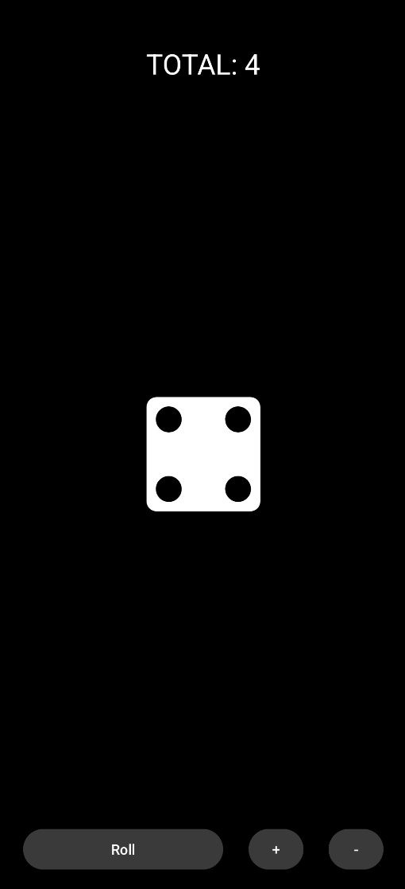
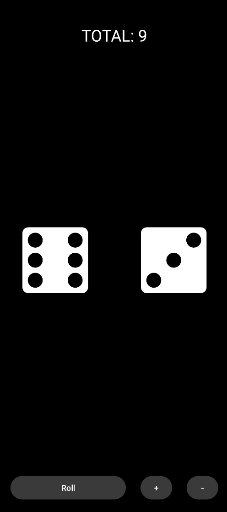
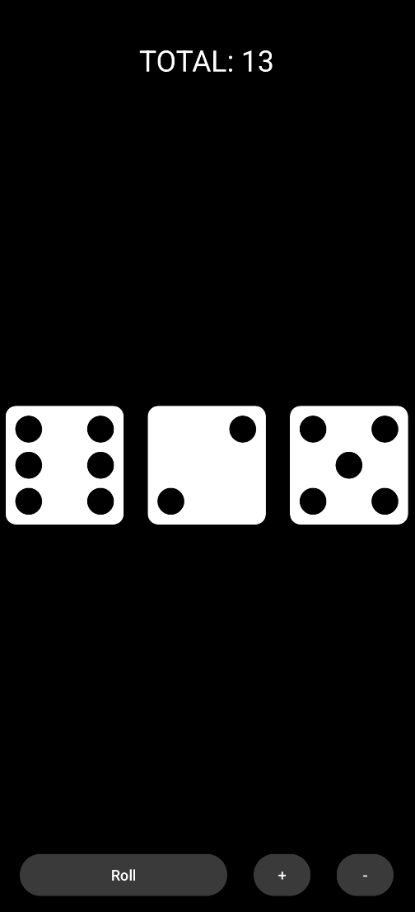

# 🎲 Dice Game (Android | Kotlin)

This is a simple Android dice game built using Kotlin. The game allows users to roll up to three dice, displaying the total value of the roll. Players can also add or remove dice, with a maximum of three active dice at a time.

## ✨ Features
- 🎲 Roll up to **three dice**
- ➕ Add or ➖ remove dice dynamically
- 📊 Displays the **total score**
- 🏆 Minimalistic and easy-to-use UI

## 📸 Screenshots

|  |  |  |
|:---:|:---:|:---:|


## 🛠️ Technologies Used
- **Kotlin**
- **Android SDK**
- **XML Layouts**

## 📥 Download
- Official stable releases of the project can be found [here](https://github.com/matheusbaeta/DiceGame/releases).

## 🚀 How to Run
1. Clone the repository:
   ```sh
   git clone https://github.com/matheusbaeta/DiceGame.git
   ```
2. Open the project in **Android Studio**.
3. Build and run the app on an emulator or physical device.

## 📜 License
This project is open-source under the **MIT License**.
